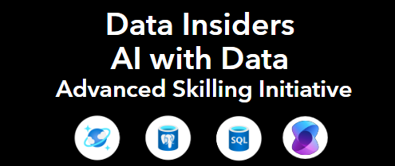

# **AI with Data Advanced Skilling Initiative**

  

## Prerequisites (One time set up for all the labs)

### python requirements

- We will be using Python version **3.11.9** for the sessions. We recommend using pyenv to set python version for your project and then create a virtual environment. Follow below steps of you are not sure how to do this:
1. [One time thing, it will be worth it!]: Install pyenv by following instructions here https://pyenv-win.github.io/pyenv-win/docs/installation.html
    - specially ensure you set the environment variables are added to user path (they guide you in above link on how to do so)
2. Restart your terminal, run below to ensure pyenv is installed: pyenv versions
    - this should give you all python versions you have. If you don't see 3.11.9, install this version by running: **pyenv install 3.11.9**
    - set local version to 3.11.9: **pyenv local 3.11.9**
3. In terminal, first go to the "labs" folder (cd labs), and then run one of below scripts to create a virtual environment: 
    - **virtualenv myenv**
    OR
    - **python -m venv myenv**
4. ENSURE Activate the virtual environment:
    - **.\myenv\Scripts\activate**
5. Install all packages in requirements.txt
    - **pip install -r requirements.txt**
- **Every time you want to run the notebooks, you would need to repeat below:**
 
    -- Go to labs folder

    -- Activate the virtual environment as step 4 above

### Azure resources
- You would need an Azure account with below resources deployed:
  - **Azure OpenAI LLM Service** (GPT-4.1 or GPT-4 deployed). 
  - **Azure OpenAI Embedding Service** (text-embedding-ada-002). 
  - **Azure Database for PostgreSQL** 
  - **Azure Cosmos DB**

  Note: At this point we are not providing scripts for automatically deploying resources, so you would need to go to your Azure portal and ensure you have these ready.

### Data requirements

#### postgreSQL database set up

Assuming you have deployed an Azure Database for postgres flexible server in your resource group:

1. Create a database with your desired name (you can do that via the portal via going to your postgres db page -> on left panel click on Databases -> clin on "+ Add" )
2. **Visit this page and follow steps to enable Microsoft Entra ID authentication for Azure Database for PostgreSQL** https://learn.microsoft.com/en-us/azure/postgresql/flexible-server/how-to-configure-sign-in-azure-ad-authentication
3. After step 2, now if you go to "Security -> Authentication" tab on left side panel of your postgres page, you should see a user with object ID added towards end of the page. **The Name there is what you should be using as your postgres username**
4. Rename the .env.sample file to .env and change below variables for with your own:
    - POSTGRES_USER (what you copied from step 3)
    - POSTGRES_HOST (it is the "Endpoint" value in Overview tab of your azure postgres page)
    - POSTGRES_DB (name of database your created at step 1)
5. Now you should be all good to initialize your postgres database with sample data we have provided in src/contoso_db.sql.
    - **Ensure you have signed in via running "az login" in terminal**
    - We have provided a script for easily populating the database. Got to src folder and run below in terminal:
        -- **python db_init.py**
        -- If set up is successful, you should see "Successfully set up the tables and closed the connection."
#### Cosmos DB

Assuming you have deployed an Azure Cosmos DB resource:

1. Head to "Data Explorer" on lefts side panel -> Create a new database (we have named it Contoso)
2. Create a new container under this database with container id "customer_chats" and put customer_id for partition key.
3. Got to your .env file:
    - For **COSMOS_CONNECTION_STRING**, put below value:
        -- In your Azure cosmos db page, in left panel, go to Settings -> Keys and copy the value under "PRIMARY CONNECTION STRING"
    - Change COSMOS_DATABASE_NAME only if you have chosen a different name for your database than "Contoso"

Nothing else needed, data for this will be populated during the labs. 

### Connecting to Azure AI services

1. You would need to create an Azure OpenAI resource in your resource group. 
2. Go to Overview ->Explore Azure AI Foundry portal
3. In "Model catalog" tab, you can search for below two models and deploy (if you don't have existing deployments):
    - gpt-4.1 
    - text-embedding-ada-002
4. After deployments are done, to get info for your .env variables, head to "Deployments" tab, click on the desired model:
    - For both the llm and embedding model, the AZURE_OPEN_AI_KEY is the same and is under "key" value 
    - For both llm and embedding models, the "ENDPOINT" variables are the  content of "Target URI" in their respective pages
    - For AZURE_OPENAI_BASE_EMBED_URL, remove everything after "text-embedding-ada-002" in the Target URI value. For example:
        -- considering this dummy Target URI: https://example.openai.azure.com/openai/deployments/text-embedding-ada-002/embeddings?api-version=2023-05-15, this would be the base embed url: https://example.openai.azure.com/openai/deployments/text-embedding-ada-002

Thank you!
    

